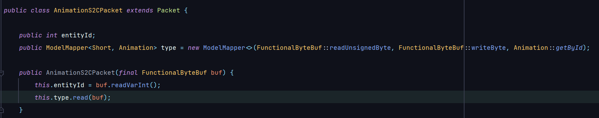

# BetaPackets
(WIP!) Standalone Minecraft protocol library for Spigot, Paper, Bukkit, BungeeCord and Velocity

### Note: This project is in very early development and not ready for production use!

## Why another protocol library?
The idea of BetaPackets is to develop a protocol library that is not based on any platform, the BetaPackets core is based only on Netty and can be implemented on anything, this ensures that this protocol library works on any server software with the same API.

## Design ideology
BetaPackets reads all packets and writes them exactly as they were read, which means that BetaPackets does not intercept invalid packets itself, but simply passes them on in the pipeline. BetaPackets tries to map everything possible into Java models, and gives the user the raw but also the model data.

Example:

Where **Animation.java** is an enum with all possible animations of the respective version, and the **Short** is simply the raw type that is in the vanilla package.

## How to use?
The BetaPacketsAPI has **3** listeners, **ClientboundPacketListener**, **ServerboundPacketListener** and **PlayerEarlyJoinPacketListener**.

| Method name in BetaPacketsAPI   | When it is called                                                                         | Parameter                                           | Cancellable |
|---------------------------------|-------------------------------------------------------------------------------------------|-----------------------------------------------------|-------------|
| registerOutgoingPacketListener  | When the server sends a packet to a player                                                | UserConnection, NetworkState, Packet, Player object | yes         |
| registerIncomingPacketListener  | When the server receives a packet from a player                                           | UserConnection, NetworkState, Packet, Player object | yes         |
| registerPlayerEarlyJoinListener | When a player has gone through the login process and the server sends the JoinGame packet | Player UUID, Player Name, Protocol Version          | no          |

The API access methods return the listener as instance and can be called via **BetaPackets.getAPI()**. The BetaPackets API also has a remove method for all listeners where you have to specify the instance of the respective listener.

### Example java code
```java
BetaPackets.getAPI().registerIncomingPacketListener(event -> {
    if (event.packet instanceof LoginSuccessS2CPacket) {
        final LoginSuccessS2CPacket packet = (LoginSuccessS2CPacket) event.packet;

        if (packet.username.equals("Kevin")) {
            event.cancel(); // Packet won't be sent to the server/next element in the netty pipeline
        }
    }
});
```

## Implementing BetaPackets in your own software/platform
BetaPackets is implemented by default on all major server platforms, in case you want to use this library in your own proxy or include it in a new server software, you need to do the following:
```java
// The object in the generic is what reflects a player or connection on your platform, 
// for example the Player interface in Bukkit or the ProxiedPlayer class in BungeeCord.
public class TestPlatformImpl implements BetaPacketsPlatform<Object> {
    private final Logger logger = LogManager.getLogManager().getLogger("TestPlatform");
    
    @Override
    public Logger getLogging() {
        return logger;
    }

    @Override
    public String getPlatformName() {
        return "TestPlatform";
    }

    @Override
    public Object getPlayer(UUID uuid) {
        return null; // This method must be built in by yourself
    }
}
```

Now, to properly include BetaPackets in the Netty pipeline, it is recommended to use the BetaPacketsPipeline, for this you make your own pipeline class for your platform in which you inherit the BetaPacketsPipeline:
```java
public class TestPlatformPipeline extends BetaPacketsPipeline {

    public TestPlatformPipeline(UserConnection userConnection) {
        super(userConnection);
    }

    @Override
    public void handlerAdded(ChannelHandlerContext ctx) {
        super.handlerAdded(ctx);

        // This line ensures that the pipeline automatically reorders itself after compression
        addAutomaticallyReorderElement(ctx.pipeline());
    }
    
    // In these getters you now define what the compression handler and the decoder/encoder handler in your Netty pipeline are called
    @Override
    public String getPacketDecompressName() { return null; }

    @Override
    public String getPacketCompressName() { return null; }

    @Override
    public String getPacketDecoderName() { return null; }

    @Override
    public String getPacketEncoderName() { return null; }
}
```
Now you simply add this TestPlatformPipeline as the first element in the Netty pipeline of a user/connection:
```java
ctx.pipeline().addFirst(new BungeeCordBetaPacketsPipeline(new UserConnection(ctx.channel())));
```

### Some networking notes:

- If you want to move the **BetaPacketsDecoder** and **BetaPacketsEncoder** in the pipeline globally, you can call the **ReorderPipelineEvent** with a target decoder and encoder, the BetaPackets handlers will then be placed in front of the target decoder/encoder
```java
ctx.pipeline().fireUserEventTriggered(new ReorderPipelineEvent("target-decoder", "target-encoder"));
```
- The implementation is not designed for codecs because most Minecraft pipelines don't use codecs, there is a **BetaPacketsCodec** but no pipeline class, that means you have to implement compression yourself. 

## Dependencies
| Dependency     | Download                                         |
|----------------|--------------------------------------------------|
| MC-Structs     | https://github.com/Lenni0451/MCStructs           |
| DietrichEvents | https://github.com/FlorianMichael/DietrichEvents |

## Supported versions
- 1.8.x

## Contact
If you encounter any issues, please report them on the
[issue tracker](https://github.com/FlorianMichael/BetaPackets/issues).  
If you just want to talk or need help with BetaPackets feel free to join my
[Discord](https://discord.gg/BwWhCHUKDf).
